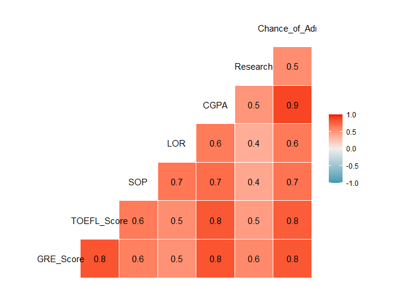
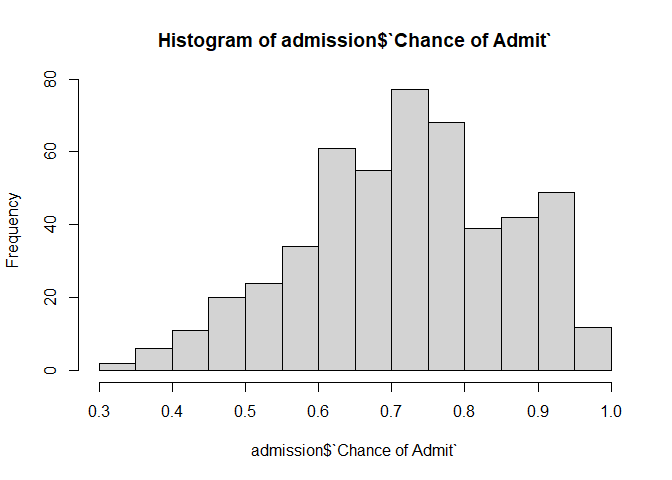
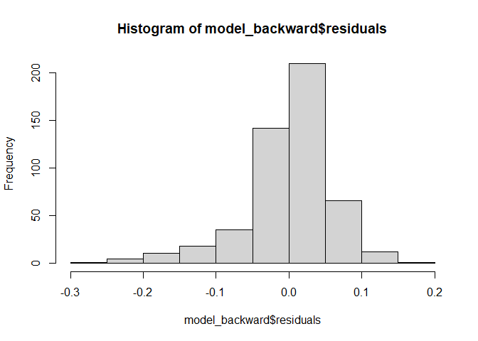
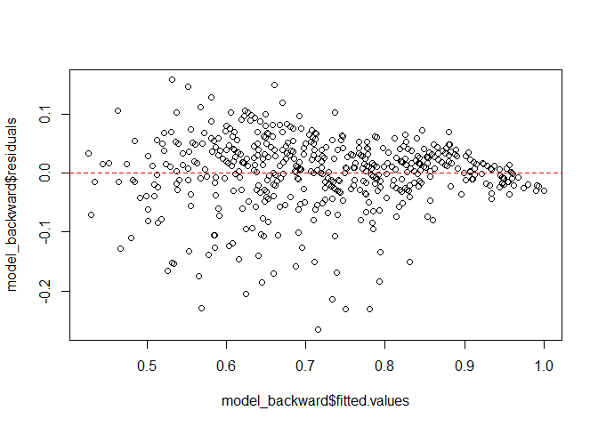
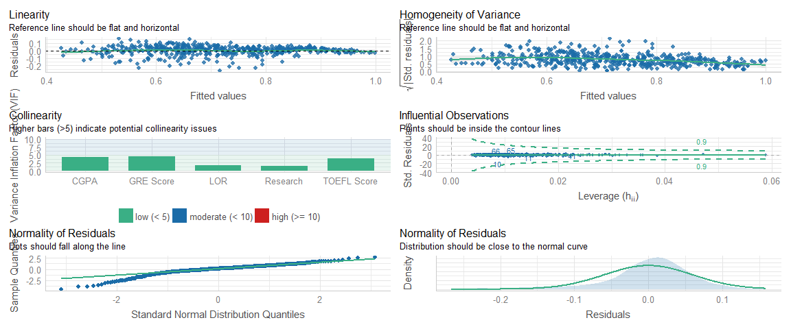

Graduate Admission
================
Syarifah Rizki
12/23/2021


# Background

The purpose of this R markdown is to find out which of the parameters
that are most significant in predicting the result of Graduate
Admissions from an Indian perspective. It could also help to predict
which applicants that are most likely to get accepted to graduate
schools and those who don’t. This can be achieved by using **linear
regression** in machine learning.

The dataset that I used here was obtained from Kaggle and was created by
Mohan S Acharya, Asfia Armaan, Aneeta S Antony : A Comparison of
Regression Models for Prediction of Graduate Admissions, IEEE
International Conference on Computational Intelligence in Data Science
2019.

# Import packages and .csv file

``` r
library(tidyverse)
```

    ## -- Attaching packages --------------------------------------- tidyverse 1.3.1 --

    ## v ggplot2 3.3.5     v purrr   0.3.4
    ## v tibble  3.1.5     v dplyr   1.0.7
    ## v tidyr   1.1.4     v stringr 1.4.0
    ## v readr   2.0.2     v forcats 0.5.1

    ## -- Conflicts ------------------------------------------ tidyverse_conflicts() --
    ## x dplyr::filter() masks stats::filter()
    ## x dplyr::lag()    masks stats::lag()

``` r
library(GGally) # to visualized the correlation among variables
```

    ## Warning: package 'GGally' was built under R version 4.1.2

    ## Registered S3 method overwritten by 'GGally':
    ##   method from   
    ##   +.gg   ggplot2

``` r
library(performance) # to compare performances from different regression models
```

    ## Warning: package 'performance' was built under R version 4.1.2

``` r
library(MLmetrics) # to check error rate such as RMSE
```

    ## Warning: package 'MLmetrics' was built under R version 4.1.2

    ## 
    ## Attaching package: 'MLmetrics'

    ## The following object is masked from 'package:base':
    ## 
    ##     Recall

``` r
library(lmtest) # Breusch-Pagan assumption check
```

    ## Warning: package 'lmtest' was built under R version 4.1.2

    ## Loading required package: zoo

    ## Warning: package 'zoo' was built under R version 4.1.2

    ## 
    ## Attaching package: 'zoo'

    ## The following objects are masked from 'package:base':
    ## 
    ##     as.Date, as.Date.numeric

``` r
library(car) # will be used in assumption check using VIF
```

    ## Warning: package 'car' was built under R version 4.1.2

    ## Loading required package: carData

    ## 
    ## Attaching package: 'car'

    ## The following object is masked from 'package:dplyr':
    ## 
    ##     recode

    ## The following object is masked from 'package:purrr':
    ## 
    ##     some

``` r
admission <- read_csv("Graduate Admission 2/Admission_Predict_Ver1.1.csv")
```

    ## Rows: 500 Columns: 9

    ## -- Column specification --------------------------------------------------------
    ## Delimiter: ","
    ## dbl (9): Serial No., GRE Score, TOEFL Score, University Rating, SOP, LOR, CG...

    ## 
    ## i Use `spec()` to retrieve the full column specification for this data.
    ## i Specify the column types or set `show_col_types = FALSE` to quiet this message.

``` r
admission
```

    ## # A tibble: 500 x 9
    ##    `Serial No.` `GRE Score` `TOEFL Score` `University Rating`   SOP   LOR  CGPA
    ##           <dbl>       <dbl>         <dbl>               <dbl> <dbl> <dbl> <dbl>
    ##  1            1         337           118                   4   4.5   4.5  9.65
    ##  2            2         324           107                   4   4     4.5  8.87
    ##  3            3         316           104                   3   3     3.5  8   
    ##  4            4         322           110                   3   3.5   2.5  8.67
    ##  5            5         314           103                   2   2     3    8.21
    ##  6            6         330           115                   5   4.5   3    9.34
    ##  7            7         321           109                   3   3     4    8.2 
    ##  8            8         308           101                   2   3     4    7.9 
    ##  9            9         302           102                   1   2     1.5  8   
    ## 10           10         323           108                   3   3.5   3    8.6 
    ## # ... with 490 more rows, and 2 more variables: Research <dbl>,
    ## #   Chance of Admit <dbl>

Columns description: 1. Serial No.: Applicants identifiers 2. GRE Score:
GRE Scores ( out of 340 ) 3. TOEFL Score: TOEFL Scores ( out of 120 ) 4.
University Rating: University Rating ( out of 5 ) 5. SOP: Statement of
Purpose ( out of 5 ) 6. LOR: Letter of Recommendation Strength ( out of
5 ) 7. CGPA: Undergraduate GPA ( out of 10 ) 8. Research: Research
Experience ( either 0 or 1 ) 9. Chance of Admit: Chance of Admit (
ranging from 0 to 1 )

# Data wrangling

``` r
admission <- admission %>% 
  mutate(`University Rating` = as.factor(`University Rating`)) %>% 
  select(-`Serial No.`)

admission
```

    ## # A tibble: 500 x 8
    ##    `GRE Score` `TOEFL Score` `University Rating`   SOP   LOR  CGPA Research
    ##          <dbl>         <dbl> <fct>               <dbl> <dbl> <dbl>    <dbl>
    ##  1         337           118 4                     4.5   4.5  9.65        1
    ##  2         324           107 4                     4     4.5  8.87        1
    ##  3         316           104 3                     3     3.5  8           1
    ##  4         322           110 3                     3.5   2.5  8.67        1
    ##  5         314           103 2                     2     3    8.21        0
    ##  6         330           115 5                     4.5   3    9.34        1
    ##  7         321           109 3                     3     4    8.2         1
    ##  8         308           101 2                     3     4    7.9         0
    ##  9         302           102 1                     2     1.5  8           0
    ## 10         323           108 3                     3.5   3    8.6         0
    ## # ... with 490 more rows, and 1 more variable: Chance of Admit <dbl>

``` r
anyNA(admission)
```

    ## [1] FALSE

All columns are already stored in their correct data types and it
doesn’t have missing values. Now, we are ready to make our linear model
from admission dataframe.

# Linear Regression

Choosing our target & predictor variables:

**Target variable**: Chance of Admit **Predictor variables**: All
variables

Check correlation between target variables and predictor variables with
ggcorr function from GGally package.

``` r
# from 'GGally' package

ggcorr(admission, label = T)
```

    ## Warning in ggcorr(admission, label = T): data in column(s) 'University Rating'
    ## are not numeric and were ignored

<!-- -->

Among the target variables, CGPA has the strongest positive correlation
with our target variable, followed by TOEFL_Score and GRE_Score.

## Create model

``` r
adm_model <- lm(`Chance of Admit`~., admission)
summary(adm_model)
```

    ## 
    ## Call:
    ## lm(formula = `Chance of Admit` ~ ., data = admission)
    ## 
    ## Residuals:
    ##       Min        1Q    Median        3Q       Max 
    ## -0.264877 -0.023222  0.007997  0.032770  0.157871 
    ## 
    ## Coefficients:
    ##                        Estimate Std. Error t value Pr(>|t|)    
    ## (Intercept)          -1.2552952  0.1061485 -11.826  < 2e-16 ***
    ## `GRE Score`           0.0018432  0.0005027   3.667 0.000273 ***
    ## `TOEFL Score`         0.0028240  0.0008730   3.235 0.001300 ** 
    ## `University Rating`2 -0.0081935  0.0120716  -0.679 0.497625    
    ## `University Rating`3 -0.0031829  0.0128089  -0.248 0.803857    
    ## `University Rating`4 -0.0009821  0.0151261  -0.065 0.948258    
    ## `University Rating`5  0.0186896  0.0171806   1.088 0.277206    
    ## SOP                   0.0023013  0.0045726   0.503 0.614986    
    ## LOR                   0.0167453  0.0041344   4.050 5.95e-05 ***
    ## CGPA                  0.1179921  0.0097161  12.144  < 2e-16 ***
    ## Research              0.0241660  0.0066318   3.644 0.000297 ***
    ## ---
    ## Signif. codes:  0 '***' 0.001 '**' 0.01 '*' 0.05 '.' 0.1 ' ' 1
    ## 
    ## Residual standard error: 0.05992 on 489 degrees of freedom
    ## Multiple R-squared:  0.8234, Adjusted R-squared:  0.8198 
    ## F-statistic: 227.9 on 10 and 489 DF,  p-value: < 2.2e-16

Summary from our adm_model:

1.  Judging from our p-values, all of the predictor variables are
    significantly related to the target variable except for LOR and SOP
2.  From column University Ranking, we have a result of 4 dummy
    variables
3.  All predictor variables have a positive correlations with the target
    variable
4.  The adjusted R-Squared for adm_model is 0.8198 . This means our
    adm_model can already explain 81.98% of the overall target variable.

We will be doing some feature engineering to select which of the
predictor columns that we should and shouldn’t keep by looking at its
AIC (information loss). This can be done using step-wise regression.

``` r
model_backward <- step(object = adm_model, direction = "backward")
```

    ## Start:  AIC=-2803.84
    ## `Chance of Admit` ~ `GRE Score` + `TOEFL Score` + `University Rating` + 
    ##     SOP + LOR + CGPA + Research
    ## 
    ##                       Df Sum of Sq    RSS     AIC
    ## - SOP                  1   0.00091 1.7567 -2805.6
    ## - `University Rating`  4   0.02334 1.7792 -2805.2
    ## <none>                             1.7558 -2803.8
    ## - `TOEFL Score`        1   0.03757 1.7934 -2795.2
    ## - Research             1   0.04768 1.8035 -2792.4
    ## - `GRE Score`          1   0.04828 1.8041 -2792.3
    ## - LOR                  1   0.05890 1.8147 -2789.3
    ## - CGPA                 1   0.52953 2.2854 -2674.0
    ## 
    ## Step:  AIC=-2805.58
    ## `Chance of Admit` ~ `GRE Score` + `TOEFL Score` + `University Rating` + 
    ##     LOR + CGPA + Research
    ## 
    ##                       Df Sum of Sq    RSS     AIC
    ## - `University Rating`  4   0.02598 1.7827 -2806.2
    ## <none>                             1.7567 -2805.6
    ## - `TOEFL Score`        1   0.03904 1.7958 -2796.6
    ## - `GRE Score`          1   0.04791 1.8046 -2794.1
    ## - Research             1   0.04796 1.8047 -2794.1
    ## - LOR                  1   0.06953 1.8263 -2788.2
    ## - CGPA                 1   0.55625 2.3130 -2670.0
    ## 
    ## Step:  AIC=-2806.24
    ## `Chance of Admit` ~ `GRE Score` + `TOEFL Score` + LOR + CGPA + 
    ##     Research
    ## 
    ##                 Df Sum of Sq    RSS     AIC
    ## <none>                       1.7827 -2806.2
    ## - `TOEFL Score`  1   0.04423 1.8269 -2796.0
    ## - `GRE Score`    1   0.05103 1.8337 -2794.1
    ## - Research       1   0.05248 1.8352 -2793.7
    ## - LOR            1   0.09358 1.8763 -2782.7
    ## - CGPA           1   0.63079 2.4135 -2656.8

Through the process of step-wise regression, SOP is the only column that
is removed from our model. Let’s now compare the performance from both
models.

``` r
# from 'performance' package

compare_performance(adm_model, model_backward)
```

    ## # Comparison of Model Performance Indices
    ## 
    ## Name           | Model |       AIC | AIC weights |       BIC | BIC weights |    R2 | R2 (adj.) |  RMSE | Sigma
    ## --------------------------------------------------------------------------------------------------------------
    ## adm_model      |    lm | -1382.896 |       0.231 | -1332.321 |     < 0.001 | 0.823 |     0.820 | 0.059 | 0.060
    ## model_backward |    lm | -1385.299 |       0.769 | -1355.796 |       1.000 | 0.821 |     0.819 | 0.060 | 0.060

Turns out, both of our models have the same number of Adjusted R-squared
but the first model that we made ‘model_backward’ has a lower number in
terms of its AIC (information loss). Which means, adm_model is a better
model for us to use because The Akaike information criterion (AIC)
itself can be defined as a metric that is used to compare the fit of
different regression models. It is also possible to have a negative AIC
result. We just have to pay attention to the difference.

``` r
model_backward$call
```

    ## lm(formula = `Chance of Admit` ~ `GRE Score` + `TOEFL Score` + 
    ##     LOR + CGPA + Research, data = admission)

``` r
# check our prediction

model_backward$fitted.values[1:5]
```

    ##         1         2         3         4         5 
    ## 0.9558608 0.8021863 0.6517081 0.7442235 0.6359131

## Error/Residual

Error/residual is the difference between our prediction and the actual
values.

Error check (RMSE)

``` r
# from 'MLmetrics' package

RMSE(y_pred = model_backward$fitted.values, y_true = admission$`Chance of Admit`)
```

    ## [1] 0.05971111

``` r
range(admission$`Chance of Admit`)
```

    ## [1] 0.34 0.97

``` r
hist(admission$`Chance of Admit`)
```

<!-- -->

## Assumption check

(Bruesch-pagan, linearity, multicollinearity, homoscedasticity)

### Normality of Residual

``` r
hist(model_backward$residuals)
```

<!-- -->

Most of the residuals are concentrated in 0, making it the shape of
normal distribution.

### Homoscedasticity of Residual (Breusch-Pagan test)

``` r
# from 'lmtest' package

bptest(model_backward)
```

    ## 
    ##  studentized Breusch-Pagan test
    ## 
    ## data:  model_backward
    ## BP = 25.825, df = 5, p-value = 9.647e-05

With Breusch-Pagan, we got p-value of 0.00009647 which has a way lower
number than the alpha (0.05). P-value \< alpha means we reject H0. In
Breusch-Pagan test, H1 means that our error variance isn’t distributed
in constant. Therefore, the model fall in the category of
Heteroscesdasticity. Check again with scatter plot.

``` r
plot(x = model_backward$fitted.values, # prediction results
     y = model_backward$residuals) # residuals
abline(h = 0, col = "red", lty = 2)
```

<!-- -->

Our plot shows the inclination towards ‘heteroscedasticity’,
particularly in the pattern of Fan Shape. We don’t want it to have any
pattern, we want it to be random. This pattern indicates that the error
standard in the backward_model isn’t distributed in constant.

### Multicollinearity

``` r
# from `car` package
vif(model_backward)
```

    ##   `GRE Score` `TOEFL Score`           LOR          CGPA      Research 
    ##      4.452473      3.799455      1.704623      4.376495      1.486588

None of our predictor variables that has a score of more than 10. This
is great because if it did score more than 10, it means that there’s a
strong correlation between one predictor variable with another and we
don’t want that to happen.

### Check all asumptions at once

By using the check_model function, we can test our models with all
assumptions.

``` r
# from 'performance' package

check_model(model_backward)
```

<!-- -->

# Conclusion

At this stage, the model that we use to predict graduate admissions is
the **model_backward**. Through the process of feature selection, we get
six variables that are considered to be important in predicting the
acceptance rate of a graduate school applicant. The six contributing
factors are: 1) GRE score 2) TOEFL Score 3) University Rating 4) LOR
(Letter of Recommendation Strength) 5) CGPA (Undergraduate GPA) and 6)
Experience in research.

In terms of our model performance, it managed to pass two out of four
assumptions check and those are the Normality of Residuals and the
Multicollinearity. However, a linear regression model should have
successfully passed all four of the assumptions check in order to be
qualified as a “good” model. Meanwhile, the model_backward model has
failed to fulfill that requirement. Therefore, we can say that
predicting graduate admissions with linear regression model wouldn’t be
the best choice that we can apply for future use. It is not sufficient
to correctly predict the acceptance rate of a grad school applicants.

Predicting with different regression models beside linear regression
would hopefully create a better model than the one that we just made.
